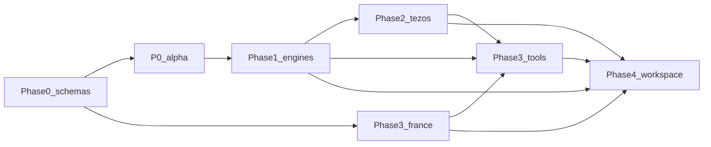

# 22 — Architecture, package contracts, workstreams, sequencing

**Spec:** §§83, 106–107, 111–112  
**Read this before writing code.** Shared interfaces MUST be defined before agents work independently.

## Architecture before UI (§106)

Stabilize first:

```text
participant schema
entity schema
evidence schema
event/leg schema
asset schema
valuation schema
source schema
rule schema
jurisdiction schema
finding schema
```

(plus position, lot, artwork, compensation right, reporting rule, scenario, case, snapshot.)

The toolbox MAY begin with thin interfaces over stable core packages.

## Avoiding duplicate business logic (§107)

One authoritative implementation for: valuation; lot matching; event normalization; rule application; source lookup.

Tax Tools consume these packages rather than reimplement them.

## Package map

| Package | Responsibility | Must not |
|---|---|---|
| `schemas` | JSON Schema, codegen | runtime I/O |
| `core` | IDs, Decimal, time, hashes, enums | chain HTTP |
| `evidence` | append-only store interface | mutate raw |
| `event-engine` | technical tx → legs/events | tax rules, France |
| `source-registry` | sources, versions, as-of publication | private ledgers |
| `rules-engine` | evaluate pack YAML | Tezos types |
| `valuation` | providers, miss, compare | lots |
| `lots` | matching methods | jurisdiction law |
| `positions` | open/close positions | tax effects |
| `reconciliation` | match suggestions | delete evidence |
| `findings` | assemble explainability traces | LLM calls |
| `exporters` | CSV/JSON/pack | vendor-only formats as default |
| `ai` | grounded explain/classify/red-team | write packs |
| `adapter-tezos` | ChainProvider TzKT | event_type NFT_SALE |
| `adapter-csv` | evidence emission | tax outcomes |
| `marketplace-objkt` | semantics overlay | replace chain evidence |

Apps: `apps/web` (`/tools` `/knowledge` `/workspace`), `apps/cli`.

## Workstreams (§112)

| ID | Name | Plans | Parallel with |
|---|---|---|---|
| A | Schemas and domain model | 02, 03, 04, 16 | — first |
| B | Public knowledge system | 05, 18 | after A schemas |
| C | Rule engine | 05, 17 | with B |
| D | Tezos data | 07 | after A event schema |
| E | Valuation | 06 | after A asset schema |
| F | Lots and accounting | 04 | after E |
| G | Tax Tools | 08, 18 | after C+D+E thin APIs |
| H | Private workspace | 09, 12 | after A storage |
| I | AI | 11 | after findings |
| J | Exports | 13, 10 | after findings |
| K | France content | 15 | after B schema, independent of D |
| L | QA/security | 12, 16, 17, 20 | continuous |

K and D are independent: France YAML vs TzKT can proceed in parallel once schemas exist.

## Tech stack (implementation choice)

- TypeScript ESM, pnpm, Turborepo, Vitest, Ajv, decimal.js
- Next.js App Router for `apps/web`
- OPFS + wa-sqlite for workspace
- Git-versioned YAML knowledge
- GitHub Actions

## Phase timeline

**Phase 0 — Repo + schemas + CI**  
Scaffold, governance docs, LICENSE, JSON Schemas (authored, not all frozen), validators, live-op spike (TzKT/OBJKT/HEN), inter-lane contract fixtures, empty jurisdiction skeletons, invariant import tests (no france in engine).

**P0-alpha — Vertical slice (W3–W8, owns engineers)**  
One real marketplace sale through legs, valuation-or-miss, France as-of or UNKNOWN, TOOL-003 + TOOL-010. First external feedback. Does not replace §102 P0. §102 date TBD until this lands.

**Phase 1 — Deterministic engines (after alpha)**  
Evidence store, event-engine, source-registry, rules-engine, valuation, lots, findings, snapshots — **informed by** the slice. Do not build this beside alpha.

**Phase 2 — Tezos proving ground**  
TzKT, OBJKT **and HEN/Teia**, baking, CSV, XTZ/EUR, reconciliation. AC-015. Incremental ingest.

**Phase 3 — France/EU + Tax Tools**  
Pack v0.1, search, time machine, rule diff, tools 001–013, homepage. AC-013.

**Phase 4 — Workspace + export + AI prototype**  
Situation explorer, corrections, professional pack, AC-007, 008, 014. Demos §113–114.

## Agent operating rules

1. MUST/MUST NOT in `INITIAL_PROMPT.md` beat these plans.
2. Do not hard-code Tezos into generic accounting models.
3. Do not hard-code France into the generic rule engine.
4. Prefer `UNKNOWN` over guessed law.
5. New tools call existing engines.
6. Every engine PR adds tests; every bug adds a §88 regression.
7. Legal content PRs require sources and dates.
8. Never request keys/seeds; never add default cloud ledger upload.

## Dependency graph


