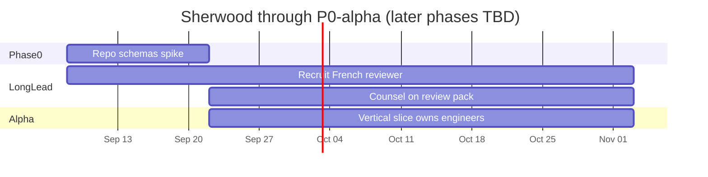

# 23 — Implementation plan, TODOs, and P0 timeline

**Completes:** [00-MASTER.md](00-MASTER.md)  
**Gate:** [20-p0-mvp-acceptance.md](20-p0-mvp-acceptance.md) (§102 items 1–54, AC-001–015, demos §113–114)  
**Contracts:** [22-architecture-workstreams.md](22-architecture-workstreams.md)  
**Multi-agent split:** [24-multi-agent.md](24-multi-agent.md)  
**Out of this timeline:** [21-p1-p2.md](21-p1-p2.md)

This is the execution schedule for the MASTER plan. Individual how-to remains in plans 01–22. If this file and a detailed plan disagree on *what* to build, the detailed plan and `INITIAL_PROMPT.md` win. If they disagree on *when*, this file wins.

## Assumptions

| Item | Default |
|---|---|
| Start | 2026-09-08 |
| Team | 2 engineers + 1 France/source researcher (can be one person wearing two hats; then add ~6 weeks) |
| Cadence | weekly integration; **inter-lane contract fixtures** frozen after a live-op spike; internal schemas stay versioned through Wave 2 |
| P0 (§102) target | **TBD** — re-estimate only after P0-alpha (P0-A-06) lands. Do not keep a fake date while adding scope. |
| Parallelism | Long-lead France reviewer + counsel start W1/W3. France *source* work may run beside alpha. Engine Phase 1 does **not**. |

Week numbers after W8 are *indicative order*, not a calendar commitment.

## Timeline overview



| Phase | Weeks | Dates | Outcome |
|---|---|---|---|
| **0** Repo, schemas, CI | W1–W2 | 2026-09-08 → 2026-09-21 | Monorepo; schemas authored; contract fixtures after live-op spike |
| **L** Long-lead (parallel) | W1→ | reviewer from 2026-09-08; counsel from 2026-09-22 | Named French reviewer search; counsel on professional pack. Does not wait on code. |
| **alpha** Vertical slice | W3–W8 | 2026-09-22 → 2026-11-02 | **Owns both engineers.** One real sale → legs → value/miss → France as-of or UNKNOWN; TOOL-003 + TOOL-010; accountant feedback (P0-A-06) |
| **1** Deterministic core | W9+ | **after P0-A-06**; dates TBD | Engines informed by the slice. Do not start this beside alpha. |
| **2** Tezos proving ground | after 1 | TBD | Live wallet, OBJKT + HEN/Teia, XTZ/EUR, AC-015 |
| **3** Knowledge + Tax Tools | after 2 | TBD | France v0.1; remaining tools; AC-013 |
| **4** Workspace, export, AI | after 3 | TBD | May be re-scoped when §102 is re-dated |
| **Gate** §102 P0 | after 4 | **TBD after alpha** | AC-001–015; demos §113–114 |

France *source collection* (P0-0-11, P0-A-03) runs during alpha because Time Machine needs it. Full pack depth and engine generalization wait until after the slice.

---

## TODO list

Status: all `pending` until implementation starts. IDs are stable; use them in commits/PRs (`Implements P0-1-04`).

### Phase 0 — W1–W2 — Foundation

P0 items: 1, 2, 3, 53.

- [ ] **P0-0-01** Scaffold pnpm/Turborepo, `packages/*` and `apps/web` + `apps/cli` stubs. → [22](22-architecture-workstreams.md), [16](16-repository-ci.md)
- [ ] **P0-0-02** Root docs: README, LICENSE, CONTRIBUTING, GOVERNANCE, SECURITY, PRIVACY, DISCLAIMER, CODE_OF_CONDUCT. → [01](01-product-philosophy-constraints.md), [19](19-governance.md)
- [ ] **P0-0-03** JSON Schema + codegen for participant, entity, wallet ownership, artwork, compensation rights. → [02](02-domain-model.md)
- [ ] **P0-0-04** JSON Schema + codegen for evidence, technical tx, leg, semantic event (full enum), annotation, fact-status. → [03](03-evidence-economic-events.md)
- [ ] **P0-0-05** JSON Schema + codegen for asset, legal classification, position, lot. → [04](04-assets-positions-lots.md)
- [ ] **P0-0-06** JSON Schema + codegen for source, source version, rule, interpretation, jurisdiction, reporting rule, case, scenario, finding, snapshot, valuation. → [05](05-knowledge-commons.md), [06](06-valuation.md), [09](09-workspace-findings.md), [10](10-audit-reporting.md), [14](14-scenarios.md)
- [ ] **P0-0-07** `packages/core`: Decimal money, zoned time, IDs, content hash. → [17](17-quality-integrity.md)
- [ ] **P0-0-08** CI: Ajv validate, unique IDs, temporal ranges, internal links, secret scan, invariant “engine must not import france/tezos”. → [16](16-repository-ci.md), [01](01-product-philosophy-constraints.md)
- [ ] **P0-0-09** LEVEL 0 jurisdiction skeletons (`eu`, `france`, placeholders). → [05](05-knowledge-commons.md), [16](16-repository-ci.md)
- [ ] **P0-0-10** `docs/invariants.md` mapping INV-001–020 to future tests. → [01](01-product-philosophy-constraints.md)
- [ ] **P0-0-11** Archive spike: Wayback/official coverage of BOFiP (and related) for 2021; Licence Ouverte mirror vs extract-only. → [15](15-france-eu.md)
- [ ] **P0-0-12** Persist 3–5 real TzKT operations (OBJKT + HEN/Teia if available) as `tests/adapters/` fixtures before treating contract JSON as stable. → [07](07-adapters-import-reconciliation.md)

**Phase 0 exit:** `pnpm validate` and `pnpm test` pass; LICENSE + DISCLAIMER present; **contract fixtures** exist. Internal JSON Schemas may still change (`schema_version` bump, no Steward RFC theater for every field).

### Long-lead (parallel with Phase 0 / alpha — not engineer-owned)

These gate credibility and item 46. They are social/legal work. Start them before they become the critical path.

- [ ] **P0-L-01** Recruit a **named** qualified French reviewer (expert-comptable or avocat) willing to attach a name and scope to the pack. Start **W1**. `review_status` stays `COMMUNITY_DRAFT` until this lands. → [15](15-france-eu.md), [19](19-governance.md)
- [ ] **P0-L-02** Get **counsel** (not UI copy) on whether a professional review pack with findings and basis tables is regulated tax advice in France. Start **W3**. Gates P0 item 46; restructure the pack if counsel says so **before** Phase 4. → [15](15-france-eu.md), [13](13-exports-api-cli.md)

### P0-alpha — W3–W8 — first external proof (owns the engineers)

Spec P0 items stay the later completeness gate. **§102 calendar is TBD until P0-A-06 is done.** Do not run Phase 1 beside this.

- [ ] **P0-A-01** Decode one real marketplace sale (prefer HEN/Teia 2021 if fixtures exist, else OBJKT) to legs. No tax types. → [07](07-adapters-import-reconciliation.md), [03](03-evidence-economic-events.md)
- [ ] **P0-A-02** Historical XTZ/EUR or explicit miss. → [06](06-valuation.md)
- [ ] **P0-A-03** France as-of sources for that date or honest “no contemporaneous capture”. → [15](15-france-eu.md), [05](05-knowledge-commons.md)
- [ ] **P0-A-04** TOOL-003 Tezos Transaction Explainer on that op. → [08](08-tax-tools.md)
- [ ] **P0-A-05** TOOL-010 Guidance Time Machine for France / NFT artist / that year. → [08](08-tax-tools.md)
- [ ] **P0-A-06** Put the pair in front of a French accountant or qualified reviewer; record what broke.

### Phase 1 — W9+ — Deterministic engines (after alpha)

P0 items: 4–13, 51–52. Workstreams A/B/C/E/F.

- [ ] **P0-1-01** Append-only evidence store (in-memory + interface for SQLite). → [03](03-evidence-economic-events.md), [12](12-privacy-security.md)
- [ ] **P0-1-02** Event engine: technical tx + marketplace overlay + ownership map → legs/events; no tax types. → [03](03-evidence-economic-events.md)
- [ ] **P0-1-03** Self-transfer detection requiring confirmed ownership (AC-004). → [02](02-domain-model.md), [03](03-evidence-economic-events.md)
- [ ] **P0-1-04** Source registry: load YAML, as-of publication vs effective vs retrieved. → [05](05-knowledge-commons.md)
- [ ] **P0-1-05** Rules engine DSL v0 + competing interpretations + UNKNOWN/REVIEW_REQUIRED. → [05](05-knowledge-commons.md), [19](19-governance.md)
- [ ] **P0-1-06** Valuation engine + mock provider + miss-not-invent + comparison/spread. → [06](06-valuation.md)
- [ ] **P0-1-07** Lot engine: FIFO, SPECIFIC_IDENTIFICATION, AVERAGE_COST; LIFO/HIFO/POOLING; self-transfer lot move; gaps → UNKNOWN. → [04](04-assets-positions-lots.md)
- [ ] **P0-1-08** Positions stub: staking/vesting state machine, schema-complete. → [04](04-assets-positions-lots.md)
- [ ] **P0-1-09** Findings builder + explainability trace (FACTS→…→UNCERTAINTY). → [09](09-workspace-findings.md)
- [ ] **P0-1-10** `analyze()` facade + analysis snapshot serialize/reproduce (AC-006). → [13](13-exports-api-cli.md), [17](17-quality-integrity.md)
- [ ] **P0-1-11** CLI: `validate-*`, `run-tests`, `analyze` on fixtures. → [13](13-exports-api-cli.md)
- [ ] **P0-1-12** Synthetic ledgers: artist, collector, baker, builder, platform (partial). → [14](14-scenarios.md), [16](16-repository-ci.md)
- [ ] **P0-1-13** Seed regression corpus (§88 eight cases) on synthetics. → [16](16-repository-ci.md), [17](17-quality-integrity.md)
- [ ] **P0-1-14** Acceptance on synthetics: AC-001, 002, 003, 004, 005, 006, 009, 010, 011, 012. → [17](17-quality-integrity.md)

**Phase 1 exit:** OBJKT-like *fixture JSON* (not live TzKT) produces legs, events, lots, sourced findings or UNKNOWN; no float money.

### Phase 2 — after Phase 1 — Tezos proving ground (dates TBD)

P0 items: 14–20. Workstream D + live E.

- [ ] **P0-2-01** `ChainProvider` interface + TzKT client (paging, no secrets). → [07](07-adapters-import-reconciliation.md)
- [ ] **P0-2-02** Public wallet import → immutable evidence + TechnicalTx (tez, FA1.2, FA2, hashes, UTC block time). → [07](07-adapters-import-reconciliation.md)
- [ ] **P0-2-03** NFT mint/burn/transfer semantic hints (not tax). → [07](07-adapters-import-reconciliation.md), [03](03-evidence-economic-events.md)
- [ ] **P0-2-04** OBJKT marketplace adapter (primary, secondary, royalty, fees, splits). → [07](07-adapters-import-reconciliation.md)
- [ ] **P0-2-05** Baking/staking reward recognition. → [07](07-adapters-import-reconciliation.md)
- [ ] **P0-2-06** Historical XTZ/EUR provider adapter + local cache. → [06](06-valuation.md)
- [ ] **P0-2-07** Generic CSV importer emitting evidence only. → [07](07-adapters-import-reconciliation.md)
- [ ] **P0-2-08** Reconciliation matcher (suggest/confirm/reject, no evidence deletion). → [07](07-adapters-import-reconciliation.md)
- [ ] **P0-2-09** Incremental ingest cursor; perf smoke on large synthetic history. → [17](17-quality-integrity.md)
- [ ] **P0-2-10** AC-015 + live/golden Tezos operation fixtures. → [17](17-quality-integrity.md), [20](20-p0-mvp-acceptance.md)

**Phase 2 exit:** a public Tezos address (or recorded golden ops) reconstructs primary/secondary/royalty/fees/self-transfers/rewards with valuations or explicit misses.

### Phase 3a — France / EU content (sources during alpha; pack depth after)

P0 items: 21–25. Workstream K. Researcher-led; engineers support YAML/CI.

- [ ] **P0-3-01** France `RESEARCH.md` + source YAML (statute/admin/FAQ metadata, dates, hashes, URLs). → [15](15-france-eu.md), [05](05-knowledge-commons.md)
- [ ] **P0-3-02** Human explanations (COMMUNITY_DRAFT) for NFT primary/secondary/royalty, collector disposal, baking, crypto compensation; historical gaps explicit. → [15](15-france-eu.md)
- [ ] **P0-3-03** Narrow machine-readable rules with tests (§86 matrix); no unsourced verified rules. → [15](15-france-eu.md), [16](16-repository-ci.md)
- [ ] **P0-3-04** EU dependency pack skeleton (VAT / place of supply references). → [15](15-france-eu.md)
- [ ] **P0-3-05** Maturity and review labels in data + UI-ready fields. → [05](05-knowledge-commons.md), [19](19-governance.md)
- [ ] **P0-3-06** Source/rule as-of query fixtures: France NFT artist 2021 vs later guidance. → [05](05-knowledge-commons.md), [14](14-scenarios.md)
- [ ] **P0-3-07** Scenario YAML library (artists/collectors/builders/crypto questions). → [14](14-scenarios.md)
- [ ] **P0-3-08** Knowledge static API generation from YAML. → [13](13-exports-api-cli.md)

**Phase 3a exit:** France pack v0.1 at honest LEVEL 1–3; Time Machine and Rule Diff have real dated sources.

### Phase 3b — after Phase 2 — Tax Tools + public web (dates TBD)

P0 items: 26–38. Workstreams G + UI. Depends on Phases 1–2 and 3a sources.

- [ ] **P0-3-09** Web app shell, disclaimer, tool homepage (§110), WCAG basics. → [18](18-ui-a11y-i18n.md), [01](01-product-philosophy-constraints.md)
- [ ] **P0-3-10** Shared tool frame (assumptions, evidence, export, open-in-workspace stub). → [08](08-tax-tools.md)
- [ ] **P0-3-11** TOOL-001 Wallet Tax Timeline. → [08](08-tax-tools.md)
- [ ] **P0-3-12** TOOL-002 Historical Asset Valuator. → [08](08-tax-tools.md), [06](06-valuation.md)
- [ ] **P0-3-13** TOOL-003 Tezos Transaction Explainer. → [08](08-tax-tools.md), [07](07-adapters-import-reconciliation.md)
- [ ] **P0-3-14** TOOL-004 NFT Sale/Purchase Reconstructor. → [08](08-tax-tools.md)
- [ ] **P0-3-15** TOOL-005 Artist Revenue Explorer (no auto-income). → [08](08-tax-tools.md)
- [ ] **P0-3-16** TOOL-006 Collector Activity Explorer. → [08](08-tax-tools.md)
- [ ] **P0-3-17** TOOL-007 Linked Wallet / Self-Transfer Mapper (confirmation required). → [08](08-tax-tools.md), [02](02-domain-model.md)
- [ ] **P0-3-18** TOOL-008 Transaction Tagger (evidence immutable). → [08](08-tax-tools.md), [03](03-evidence-economic-events.md)
- [ ] **P0-3-19** TOOL-009 Tax Data Health Check. → [08](08-tax-tools.md)
- [ ] **P0-3-20** TOOL-010 Guidance Time Machine. → [08](08-tax-tools.md), [05](05-knowledge-commons.md)
- [ ] **P0-3-21** TOOL-011 Rule Diff. → [08](08-tax-tools.md), [05](05-knowledge-commons.md)
- [ ] **P0-3-22** TOOL-012 Evidence Pack Generator (subset). → [08](08-tax-tools.md), [13](13-exports-api-cli.md)
- [ ] **P0-3-23** TOOL-013 generic CSV/JSON export. → [08](08-tax-tools.md), [13](13-exports-api-cli.md)
- [ ] **P0-3-24** Knowledge browse + as-of search UI. → [05](05-knowledge-commons.md), [18](18-ui-a11y-i18n.md)
- [ ] **P0-3-25** AC-013 (tools usable without workspace). → [17](17-quality-integrity.md)

**Phase 3b exit:** homepage lists all P0 tools; several work from a public address or op hash with no account.

### Phase 4 — after Phase 3 — Workspace, professional export, AI (dates TBD; item 46 gated on P0-L-02)

P0 items: 13 (storage complete), 39–50, 54. Workstreams H, I, J, L.

- [ ] **P0-4-01** Local OPFS SQLite workspace; encrypted project file; no account. → [09](09-workspace-findings.md), [12](12-privacy-security.md)
- [ ] **P0-4-02** Situation explorer (facts, not jargon). → [09](09-workspace-findings.md)
- [ ] **P0-4-03** Participant profile + residency chronology (user-declared). → [02](02-domain-model.md), [09](09-workspace-findings.md)
- [ ] **P0-4-04** Wallet ownership UI + entity graph (personal vs company). → [02](02-domain-model.md), [09](09-workspace-findings.md)
- [ ] **P0-4-05** Event correction / annotations without mutating evidence (AC-009). → [03](03-evidence-economic-events.md), [09](09-workspace-findings.md)
- [ ] **P0-4-06** Valuation review (misses first). → [06](06-valuation.md), [09](09-workspace-findings.md)
- [ ] **P0-4-07** Findings + explainability UI; no unsourced legal conclusions (AC-001, AC-014). → [09](09-workspace-findings.md)
- [ ] **P0-4-08** Analysis snapshots in UI. → [09](09-workspace-findings.md), [17](17-quality-integrity.md)
- [ ] **P0-4-09** Professional review pack (16 sections). → [13](13-exports-api-cli.md)
- [ ] **P0-4-10** Open-in-workspace from tools. → [08](08-tax-tools.md), [09](09-workspace-findings.md)
- [ ] **P0-4-11** Privacy/security: no seed fields, sanitizers, network consent chips, telemetry forbid-list. → [12](12-privacy-security.md)
- [ ] **P0-4-12** AI opt-in: grounded explanation, candidate classification, missing facts, red-team; fail closed (AC-007). → [11](11-ai.md)
- [ ] **P0-4-13** Reporting-rule schema wired as unsupported domains (no tax-base mix-up). → [10](10-audit-reporting.md)
- [ ] **P0-4-14** Offline: cached packs + prices allow analysis without network. → [12](12-privacy-security.md)

**Phase 4 exit:** local project can run the primary demo narrative without uploading a ledger (AC-008).

### Gate — Demos and P0 declaration (dates TBD after P0-A-06)

- [ ] **P0-G-01** Primary demo fixture + click-through (§113, 18 steps). → [14](14-scenarios.md), [20](20-p0-mvp-acceptance.md)
- [ ] **P0-G-02** Secondary demo: entity vs personal, fees vs transfers, corporate UNKNOWN (§114). → [14](14-scenarios.md), [02](02-domain-model.md)
- [ ] **P0-G-03** All AC-001–015 green in CI. → [17](17-quality-integrity.md)
- [ ] **P0-G-04** Checklist §102 items 1–54 signed off. → [20](20-p0-mvp-acceptance.md)
- [ ] **P0-G-05** Browser pass: tools + knowledge + workspace (desktop + narrow). → [18](18-ui-a11y-i18n.md)
- [ ] **P0-G-06** Success-condition copy review against §115 / maxims (MASTER §13–14). → [00-MASTER.md](00-MASTER.md)
- [ ] **P0-G-07** Explicit P1 backlog only; no silent scope creep from [21](21-p1-p2.md).

**MASTER complete (P0):** date **TBD**. Re-estimate in writing after P0-A-06 (what the accountant broke, what HEN taught the schemas, counsel on the pack). Until then, do not publish a §102 ship date.

---

## TODO index by plan file

| Plan | TODO IDs |
|---|---|
| 01 Philosophy / invariants | P0-0-02, P0-0-08, P0-0-10, P0-3-09 |
| 02 Domain model | P0-0-03, P0-1-03, P0-3-17, P0-4-03, P0-4-04, P0-G-02 |
| 03 Evidence / events | P0-0-04, P0-1-01, P0-1-02, P0-2-03, P0-3-18, P0-4-05 |
| 04 Assets / lots | P0-0-05, P0-1-07, P0-1-08 |
| 05 Knowledge / rules | P0-0-06, P0-0-09, P0-1-04, P0-1-05, P0-3-01, P0-3-05, P0-3-06, P0-3-20, P0-3-21, P0-3-24 |
| 06 Valuation | P0-0-06, P0-1-06, P0-2-06, P0-3-12, P0-4-06 |
| 07 Adapters | P0-2-01 … P0-2-08, P0-3-13 |
| 08 Tax Tools | P0-3-10 … P0-3-23, P0-4-10 |
| 09 Workspace / findings | P0-0-06, P0-1-09, P0-4-01 … P0-4-08, P0-4-10 |
| 10 Reporting | P0-0-06, P0-4-13 |
| 11 AI | P0-4-12, P0-G-03 (AC-007) |
| 12 Privacy / security | P0-1-01, P0-4-01, P0-4-11, P0-4-14 |
| 13 Export / API / CLI | P0-1-10, P0-1-11, P0-3-08, P0-3-22, P0-3-23, P0-4-09 |
| 14 Scenarios / demos | P0-1-12, P0-3-06, P0-3-07, P0-G-01, P0-G-02 |
| 15 France / EU | P0-0-11, P0-3-01 … P0-3-04, P0-L-01, P0-L-02 |
| 16 Repo / CI | P0-0-01, P0-0-08, P0-1-12, P0-1-13, P0-3-03 |
| 17 Quality / ACs | P0-0-07, P0-1-10, P0-1-13, P0-1-14, P0-2-09, P0-2-10, P0-3-25, P0-4-08, P0-G-03 |
| 18 UI / a11y | P0-3-09, P0-3-24, P0-G-05 |
| 19 Governance | P0-0-02, P0-1-05, P0-3-05, P0-L-01, P0-L-02 |
| 20 P0 gate | P0-2-10, P0-G-01 … P0-G-04, P0-G-06 |
| 21 P1/P2 | P0-G-07 only (exclude from P0) |
| 22 Architecture | P0-0-01, Phase 0 freeze |

---

## Staffing and critical path

```text
W1–W2   both engineers: Phase 0. Maintainer: start P0-L-01 (reviewer search).
W3–W8   both engineers: P0-alpha only. Researcher: sources for Time Machine + P0-0-11.
        Maintainer: P0-L-02 (counsel). Do not start Phase 1 engines here.
W9+     Phase 1+ as re-estimated after P0-A-06.
```

**Critical path through alpha:** schemas/spike (W2) → one real op decode → valuation or miss → France as-of → TOOL-003 + TOOL-010 → accountant (P0-A-06).

**Long-lead path (social):** P0-L-01 from W1; P0-L-02 from W3. These gate `EXPERT_REVIEWED` and item 46, not the alpha demo.

**Second path after alpha:** generalize engines, HEN/OBJKT coverage, remaining tools. Dates TBD.

## Risk buffer (re-estimated after alpha; do not pretend W22–W24 still exists)

| Risk | Mitigation |
|---|---|
| TzKT shape / rate limits | Golden recorded ops; second ChainProvider stub |
| France sources slow | LEVEL 1–2 honest; executable rules stay narrow |
| 13 tools too many | Tools are thin wrappers; slip UI polish not engines |
| 100k-event perf | Incremental ingest; do not block P0 on CI 100k |
| AI vendor / privacy | Ship prototype off-by-default; AC-007 on fixtures |

## After MASTER (not scheduled here)

P1/P2 in [21-p1-p2.md](21-p1-p2.md): other jurisdictions, EVM/Solana, P1 tools, source monitoring, filing. Start P1 planning only after P0-G-04.
